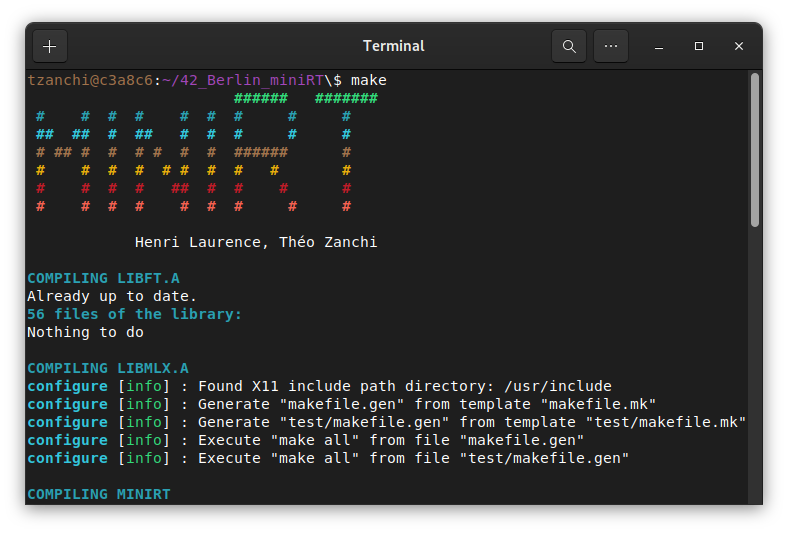
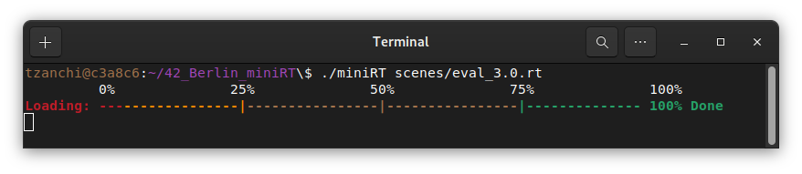
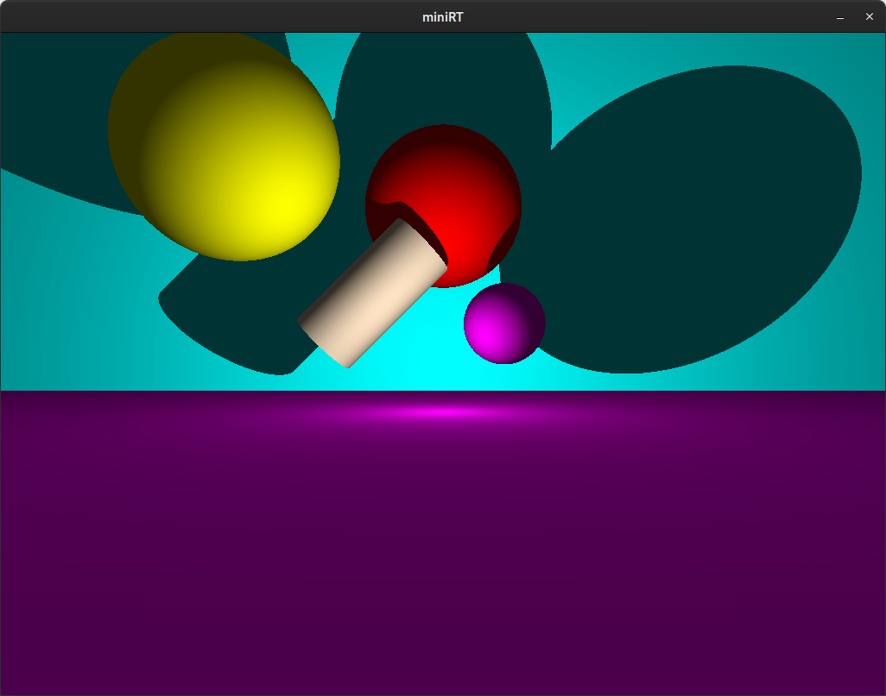
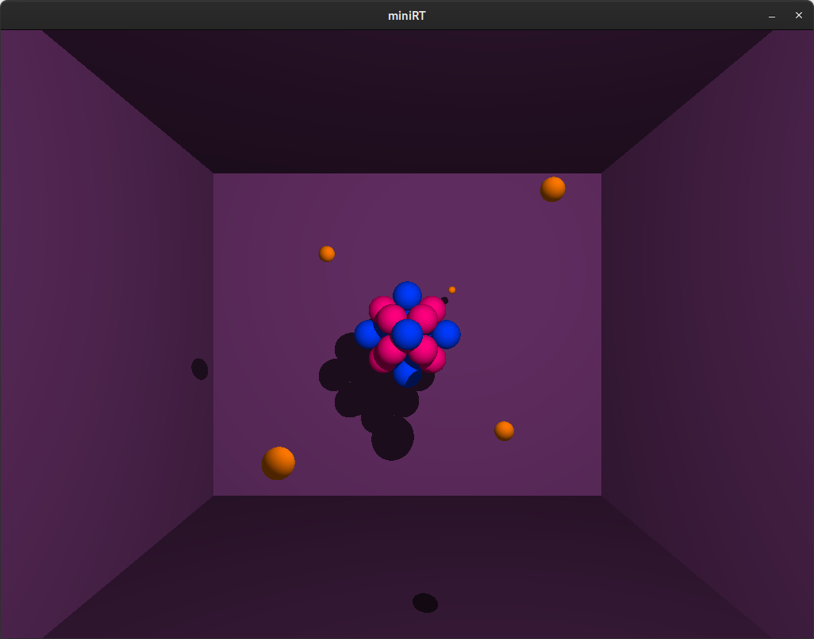
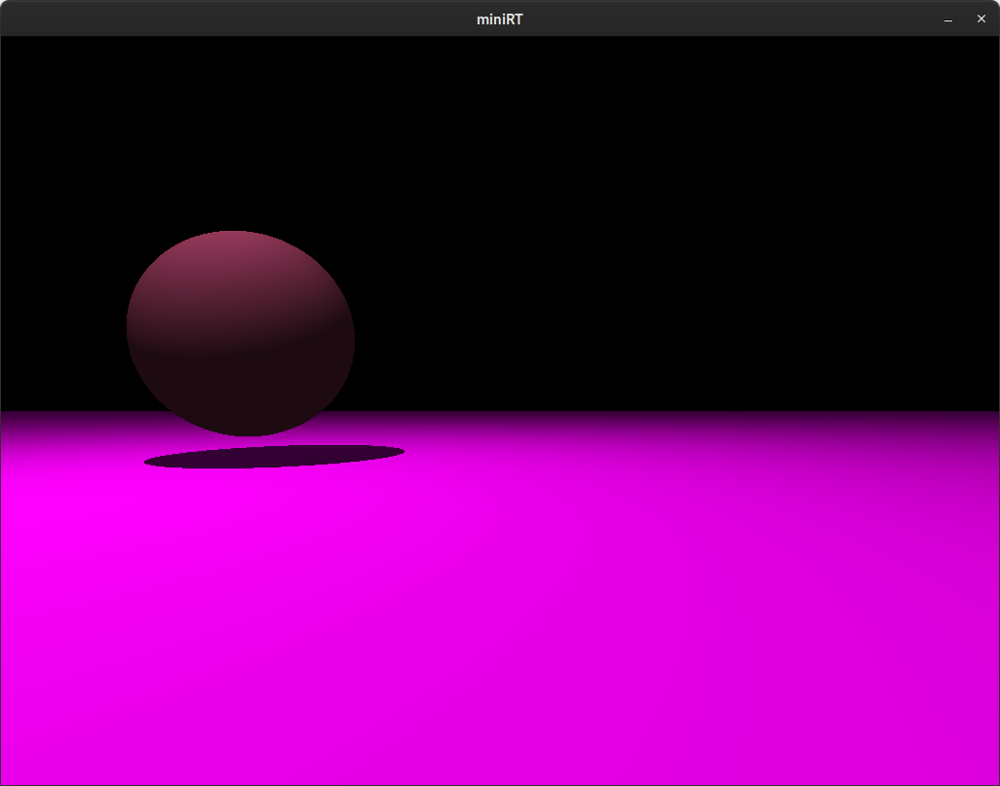

  

# miniRT

This project is about creating a ray tracer to render 3D scenes.
It is a group project done with Henri Laurence

The full subject can be found [here](.media/en.subject.pdf).

# Downloading and compiling the project

Clone the library and use `make` to compile
```shell
git clone https://github.com/theozanchi/42_Berlin_minirt/tree/main
cd 42_Berlin_miniRT
make
```


# Running the program
The program is launched without one argument, the `.rt` file that contains the information about the scene to render:



# Supported options of the `.rt` file
Here is an example of a config file for a scene: 
```
A 0.2							255,255,255

C 0,0,-10		0,0,1			80

L 0,0.1,1.0		0.8				255,255,255

sp 0,5,7		5				255,0,0 
sp 1.5,1,3		2				255,0,255 
sp -6,6,5		6				255,255,0 

pl 0,0,10		0,0,1			0,255,255 
pl 0,-1,0		0,1,0			255,0,255 

cy -2,2,5		1,1,0	2	4	255,228,196
```
The parameters are the following: 
* `A` `intensity` `rgb` - Ambient lighting
* `C` `position` `orientation` `focal` - Camera
* `L` `position` `intensity` `color` - Spotlight
* `sp` `position` `diameter` `color` - A sphere
* `pl` `position` `orientation` `color` - A plane
* `cy` `position` `orientation` `diameter` `height` `color` - A cylinder

This scene is rendered as follow: 



# Some other examples of rendered scenes



# Options
In the header file `minirt.h`, the following flags can be adjusted: 
* `SHADOW` to able or disable shadows in the scene
* `SPECULAR` to able or disable specular reflection